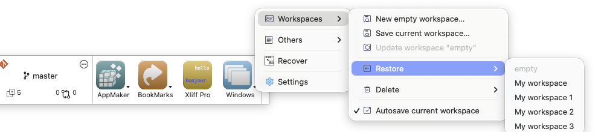
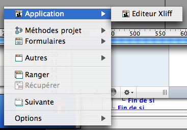
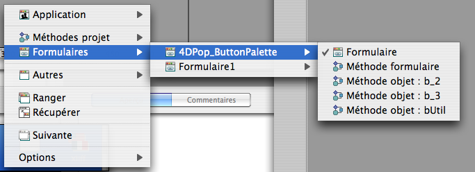

<!-- MARKDOWN LINKS & IMAGES -->
[release-shield]: https://img.shields.io/github/v/release/vdelachaux/4DPop-Window.svg?include_prereleases
[release-url]: https://github.com/vdelachaux/4DPop-Window.svg/releases/latest

[license-shield]: https://img.shields.io/github/license/vdelachaux/4DPop-Window.svg

<!--BADGES-->

 
[![release][release-shield]][release-url]
[![license][license-shield]](LICENSE)
 

# 4DPop Window

4DPop Window provides a structured, developer-friendly menu of currently open design windows in 4D.
It helps you navigate quickly across project methods, forms, classes, database methods, triggers, and application windows.

The component also includes window management commands and, most importantly, persistent workspaces so you can save and restore full editing contexts.

## Highlights

- Hierarchical menu of open windows, grouped by type.
- Fast actions for window management:
	- Bring to front
	- Next window
	- Stack windows
	- Put frontmost window back on screen
- Workspace management:
	- Create a new empty workspace
	- Save current open windows as a workspace
	- Restore a saved workspace
	- Update current workspace
	- Delete workspace
	- Optional autosave for the current workspace
- Built-in Settings dialog to configure default action and menu behavior.

## What Is New: Saved Workspaces

Workspaces are now a central part of the workflow.

### User story

As a developer, I often switch between different tasks during the day:
- debugging business logic,
- editing UI forms,
- working on database methods,
- checking application behavior in test windows.

With workspaces, I can save each context and return to it instantly later, without manually reopening everything.

### How it works

1. Open your current set of design windows.
2. Save them as a named workspace.
3. Continue working, or switch to another context.
4. Restore any saved workspace from the Window menu.
5. Enable autosave for the current workspace if you want live updates while you work.

This makes context switching faster and safer, especially in large projects.

Workspace management from the 4DPop menu:

## Installation

### Recommended (4D v21+): [Project dependencies](https://developer.4d.com/docs/Project/components/#adding-a-github-or-gitlab-dependency)

Use the 4D Dependencies Manager UI to install the component:

1. Open your project in 4D (v21+).
2. Open the Dependencies Manager.
3. Add a GitHub dependency.
4. Enter the GitHub repository address: `vdelachaux/4DPop-Window`.
5. Choose the version you want (for example `latest`).
6. Apply changes and let 4D update project dependencies.

No manual JSON editing is required.

### Fallback for binary databases or legacy setups

If you are not using project dependencies (for example in older or binary database workflows):

1. Copy `4DPop Window.4dbase` (or create an alias) into the `Components` folder next to your structure.
2. Restart the database.

## Usage

Use the Window menu entry from 4DPop to open the hierarchical list of currently open windows.

The menu is the primary experience and should be preferred over the legacy floating palette workflow.

### Open windows menu

The menu groups windows by category, including:
- Application windows
- Project methods
- Forms (with related form methods and object methods)
- Classes
- Database methods
- Triggers
- Other development windows

It is designed for quick navigation and better focus in large projects.

### Window actions

From the same menu, you can:
- Jump to any window
- Move to the next window
- Reorganize windows in a stack
- Recover frontmost off-screen windows

### Workspace actions

Workspace commands are available directly from the menu:
- New workspace
- Save workspace
- Update current workspace
- Restore workspace
- Delete workspace
- Toggle autosave

### Settings dialog

A Settings dialog is available directly from the same menu.

It lets you configure key behavior, including:
- Default action (show menu, next window, or stack windows)
- Submenu behavior
- Palette visibility option (legacy, optional)

## Screenshots

Open windows menu:

Grouped windows menu:

## Source code

The component is distributed in compiled form, with source code available in the `Sources` folder inside the component.
